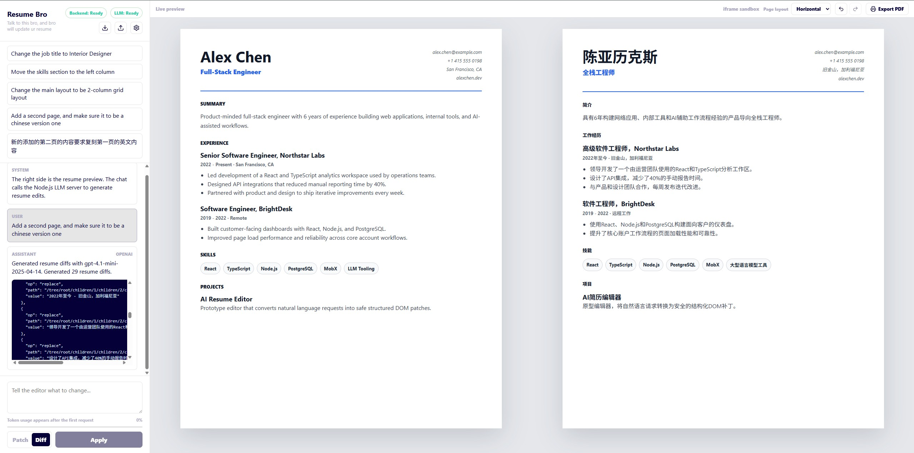
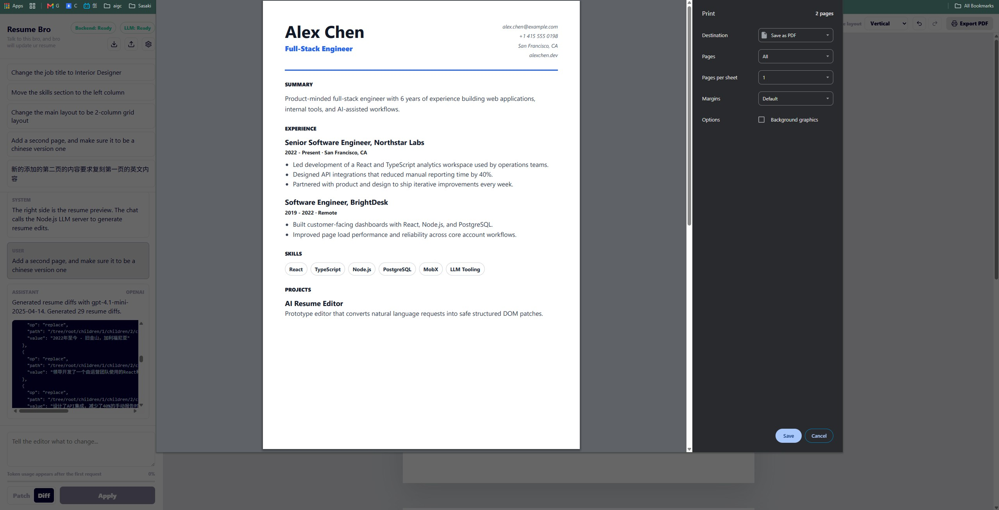
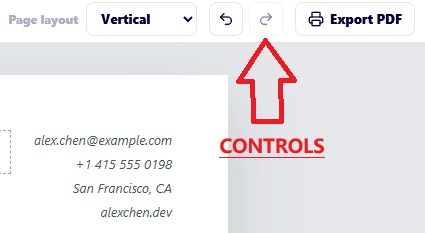
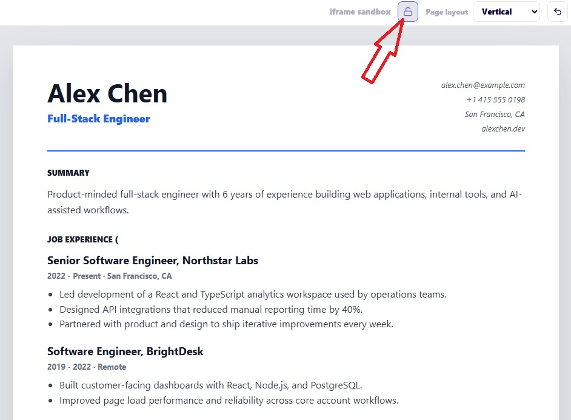

# resume-agent

Resume editing MVP. The app runs a React client plus a local Hono backend. The
backend sends editing instructions to the configured LLM provider, then returns
validated JSON patches or resume diffs for the browser to apply to the preview.




## Client Controls

The preview panel has two built-in controls:

- **Direct edit** – Click the unlock icon to edit text inline in the resume
  preview. Click the lock icon to disable editing.
- **Export PDF** – Click the **Export PDF** button to print the preview as a PDF.





The backend supports:

- Ollama, for local-first development.
- OpenAI-compatible chat completions, enabled with `OPENAI_API_KEY` or
  `LLM_PROVIDER=openai`.

## Prerequisites

- Node.js 22+
- pnpm 10+
- One LLM provider:
  - Ollama running locally, or
  - an OpenAI API key

For Ollama, install it from <https://ollama.com>, then pull the default model:

```bash
ollama pull qwen2.5-coder:7b
```

## LLM Configuration

Create a `.env` file in the repository root when you need to override defaults.

### OpenAI

```bash
LLM_PROVIDER=openai
OPENAI_API_KEY=sk-...
OPENAI_MODEL=gpt-4o
OPENAI_BASE_URL=https://api.openai.com/v1
```

`OPENAI_API_KEY` is enough to select the OpenAI provider automatically.
`LLM_PROVIDER=openai` makes that choice explicit and fails fast if the key is
missing.

`OPENAI_BASE_URL` may point at any OpenAI-compatible chat completions endpoint.
Set it to the API root, for example `https://api.openai.com/v1`; the backend
will call `/chat/completions` under that base URL.

### Ollama

```bash
OLLAMA_MODEL=qwen2.5-coder:7b
OLLAMA_CHAT_URL=http://localhost:11434/api/chat
```

To use Ollama, leave `OPENAI_API_KEY` unset and do not set
`LLM_PROVIDER=openai`. The backend defaults to Ollama in that case.

## Run Locally

Start Ollama:

```bash
ollama run qwen2.5-coder:7b
```

Skip this step if you are using OpenAI.

In another terminal, install dependencies and start the backend:

```bash
git clone https://github.com/george-yi-hao-xu/resume-agent.git
cd resume-agent
pnpm install
pnpm run server:dev
```

In a third terminal, start the client:

```bash
pnpm run client:dev
```

Open the local URL printed by Vite, usually:

```text
http://localhost:5173
```

The Vite dev server proxies `/api/*` to the backend at:

```text
http://localhost:3003
```

Use `SERVER_PORT` to change the backend port. If you change it, also update the
Vite proxy target in `client/vite.config.ts`.

## Troubleshooting

Check that the backend is running:

```bash
curl http://localhost:3003/health
```

Check that Ollama is running when using the Ollama provider:

```bash
curl http://localhost:11434/api/tags
```

If `ollama serve` says the address is already in use, Ollama is already running.

If the app says the model is missing, pull it again:

```bash
ollama pull qwen2.5-coder:7b
```

GitHub Pages is useful for viewing the UI, but browser calls from
`https://george-yi-hao-xu.github.io` to the local backend need extra deployment
or CORS setup. For development, use `pnpm run server:dev` and
`pnpm run client:dev` locally.

## Commands

```bash
pnpm run server:dev     # start local Hono backend on port 3003
pnpm run client:dev     # start local Vite dev server
pnpm test
pnpm run build
```
