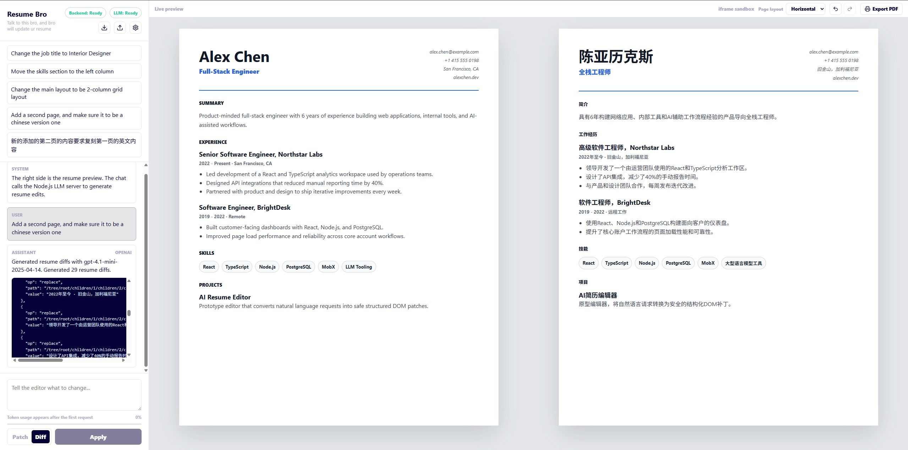
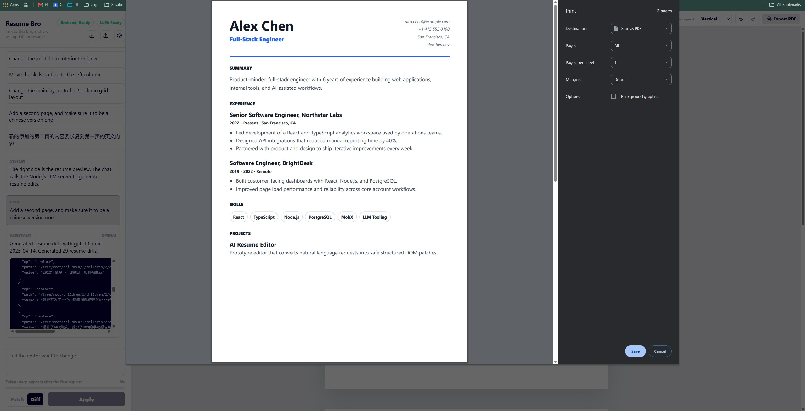
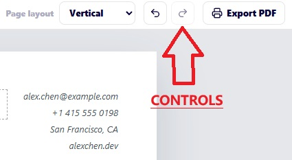
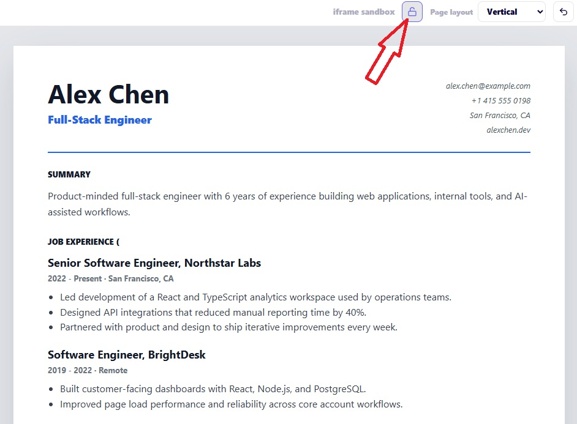

# resume-agent

Resume editing MVP. The app runs a React client plus a local backend. The
backend sends editing instructions to the configured LLM provider, then returns
validated resume diffs for the browser to apply to the preview.

The current backend is built with [nanobot](https://github.com/HKUDS/nanobot)
(Python). The original Hono/TypeScript backend is preserved under
`legacy/hono_bk_end/`.




## Client Controls

The preview panel has two built-in controls:

- **Direct edit** – Click the unlock icon to edit text inline in the resume
  preview. Click the lock icon to disable editing.
- **Export PDF** – Click the **Export PDF** button to print the preview as a PDF.





The backend supports:

- Ollama, for local-first development.
- OpenAI-compatible chat completions, enabled with `OPENAI_API_KEY` or
  `LLM_PROVIDER=openai`.

## Prerequisites

- Node.js 22+
- pnpm 10+
- Python 3.11+
- One LLM provider:
    - Ollama running locally, or
    - an OpenAI API key

For Ollama, install it from <https://ollama.com>, then pull the default model:

```bash
ollama pull glm4:latest
```

## LLM Configuration

Create a `.env` file in the repository root when you need to override defaults.

### OpenAI

```bash
LLM_PROVIDER=openai
OPENAI_API_KEY=sk-...
OPENAI_MODEL=gpt-4o
OPENAI_BASE_URL=https://api.openai.com/v1
```

`OPENAI_API_KEY` is enough to select the OpenAI provider automatically.
`LLM_PROVIDER=openai` makes that choice explicit and fails fast if the key is
missing.

`OPENAI_BASE_URL` may point at any OpenAI-compatible chat completions endpoint.
Set it to the API root, for example `https://api.openai.com/v1`; the backend
will call `/chat/completions` under that base URL.

### Ollama

```bash
OLLAMA_MODEL=glm4:latest
OLLAMA_CHAT_URL=http://localhost:11434/api/chat
```

To use Ollama, leave `OPENAI_API_KEY` unset and do not set
`LLM_PROVIDER=openai`. The backend defaults to Ollama in that case.

## Run Locally

Start Ollama:

```bash
ollama run glm4:latest
```

Skip this step if you are using OpenAI.

In another terminal, set up the Python backend:

```bash
cd nanobot_bk_end
python3 -m venv .venv
source .venv/bin/activate
pip install -r requirements.txt
uvicorn src.main:app --reload --port 3003
```

In a third terminal, install JS dependencies and start the client:

```bash
pnpm install
pnpm run client:dev
```

Open the local URL printed by Vite, usually:

```text
http://localhost:5173
```

The Vite dev server proxies `/api/*` to the backend at:

```text
http://localhost:3003
```

Use `SERVER_PORT` to change the backend port. If you change it, also update the
Vite proxy target in `client/vite.config.ts`.

## Troubleshooting

Check that the backend is running:

```bash
curl http://localhost:3003/health
```

Check that Ollama is running when using the Ollama provider:

```bash
curl http://localhost:11434/api/tags
```

If `ollama serve` says the address is already in use, Ollama is already running.

If the app says the model is missing, pull it again:

```bash
ollama pull glm4:latest
```

GitHub Pages is useful for viewing the UI, but browser calls from
`https://george-yi-hao-xu.github.io` to the local backend need extra deployment
or CORS setup. For development, use `pnpm run server:dev` and
`pnpm run client:dev` locally.

## Commands

```bash
# Python backend (run from nanobot_bk_end with the virtualenv active)
uvicorn src.main:app --reload --port 3003

# Frontend
pnpm run client:dev     # start local Vite dev server
pnpm run client:test
pnpm run client:build

# Legacy Hono backend (archived)
pnpm run legacy:server:dev

# Convenience scripts (virtualenv must be active)
pnpm run nanobot:dev    # uvicorn reload on port 3003
pnpm run nanobot:start  # uvicorn production-ish start
```
